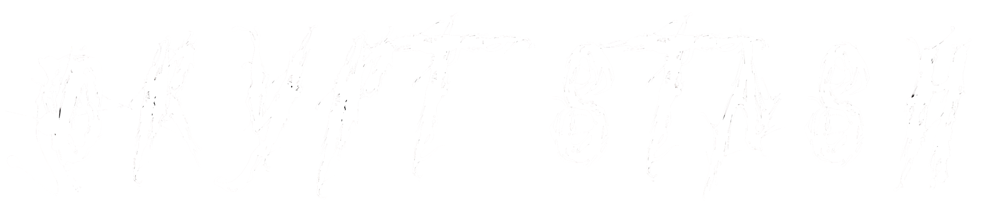
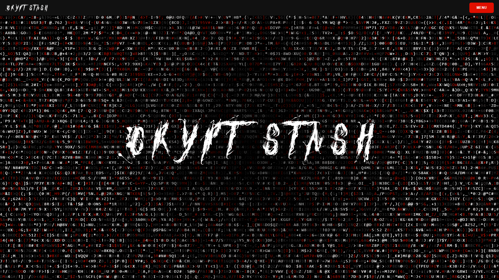

# 

> **Dual-layered security through steganography + cryptography — hide secrets in plain sight.**

Crypt Stash is an advanced, multi-format steganography and cryptography web application that empowers users to securely conceal secret messages within everyday carrier files — Images, Videos, Audio, and plain Text — without any perceptible alteration to the original medium.

---

## 📌 Table of Contents

- [What is Crypt Stash?](#-what-is-crypt-stash)
- [Screenshots](#-screenshots)
- [Features](#-features)
- [Tech Stack](#-tech-stack)
- [Cryptographic Security Model](#-cryptographic-security-model)
- [Steganography Engines](#-steganography-engines)
- [Execution Flow](#-execution-flow)
- [Installation & Setup](#-installation--setup)
- [Project Structure](#-project-structure)
- [Security Considerations](#-security-considerations)
- [License](#-license)

---

## 🧠 What is Crypt Stash?

Most steganography tools rely solely on **"Security through Obscurity"** — they hide data, but if someone knows where to look, the data is exposed. Crypt Stash takes this further with a **dual-layered security model**:

1. **Encryption Layer** — Your secret message is first encrypted using military-grade **AES-256 (Fernet)** encryption, deriving the key from your password via **PBKDF2 HMAC SHA-256**. Even if someone extracts the hidden data, they only see meaningless ciphertext without the correct password.

2. **Steganography Layer** — The encrypted ciphertext is then mathematically injected into the binary structure of a carrier file using format-specific steganographic engines. The carrier file looks and behaves completely normally.

This combination ensures **true confidentiality**: the message is hidden *and* unreadable without the password.

---

## 📸 Screenshots

### Dashboard

*Home Page*

---

## ✨ Features

- 🖼️ **Image Steganography** — Embed secrets in PNG/BMP files using LSB substitution with zero visible impact.
- 🎬 **Video Steganography** — Inject data frame-by-frame across MP4/AVI videos; output transcoded to lossless FFV1 AVI.
- 🔊 **Audio Steganography** — Hide messages in WAV files by modifying PCM audio samples at the bit level.
- 📝 **Text Steganography** — Encode binary data as invisible Unicode zero-width characters inside plain text.
- 🔐 **AES-256 Encryption** — All payloads encrypted before injection; PBKDF2 key derivation with 100,000 iterations.
- 📦 **File Metadata Logging** — All encoding operations logged to a SQLite database for traceability.
- ⬇️ **Streaming Downloads** — Processed files returned as binary streams for immediate download.
- 🎨 **Glassmorphism UI** — Modern React frontend with drag-and-drop file interfaces.

---

## 🏗️ Tech Stack

### Frontend
| Technology | Purpose |
|---|---|
| React.js + Vite | UI framework and build tooling |
| Material-UI (MUI) v5 | Component library (Material Design 3) |
| Vanilla CSS | Glassmorphism styling effects |
| PixelCard | Navigation components |
| LetterGlitch | Aesthetic text animations |
| Vercel | Hosting and deployment |

### Backend
| Technology | Purpose |
|---|---|
| Python FastAPI | REST API framework |
| Uvicorn | ASGI server |
| OpenCV (cv2) | Image and video frame matrix manipulation |
| Wave | Raw audio byte stream editing |
| Cryptography (Fernet) | AES-256 encryption implementation |
| SQLite + SQLAlchemy | Database and ORM |
| Alembic | Database migrations |

---

## 🛡️ Cryptographic Security Model

### Key Derivation
Plaintext passwords are never used directly as encryption keys. Instead, they are processed through **PBKDF2 HMAC** (Password-Based Key Derivation Function 2):

- **Algorithm:** SHA-256
- **Iterations:** 100,000 (computationally expensive to brute-force)
- **Output:** A deterministic, 32-byte cryptographic key

This means an attacker cannot simply guess your password by trying thousands of combinations per second — the cost of each guess is multiplied 100,000 times.

### Encryption
The derived 32-byte key is used for **AES-256 Fernet symmetric encryption**:

- **AES-256** is the gold standard in symmetric encryption, used by governments and security agencies worldwide.
- **Fernet** provides authenticated encryption — it encrypts *and* signs the ciphertext, detecting any tampering.
- The output is a randomized byte sequence that reveals nothing about the original message.

### Pipeline
```
Plaintext Password
       │
       ▼
PBKDF2 HMAC SHA-256 (100,000 iterations)
       │
       ▼
32-byte AES Key ──────────────────────────┐
                                          │
Secret Message                            │
       │                                  ▼
       └──────────► AES-256 Fernet Encryption
                           │
                           ▼
                    Ciphertext Payload
                           │
                           ▼
               Steganography Engine (format-specific)
                           │
                           ▼
          Modified Carrier File (visually/audibly identical)
```

---

## 📦 Steganography Engines

### 1. 🖼️ Image Steganography (LSB)

**Method:** Least Significant Bit (LSB) Substitution

The image's pixel array is flattened into a 1D byte stream. Each byte represents an RGB color channel value (0–255). The engine replaces only the **last bit** of each byte with one bit of ciphertext.

**Why it's undetectable:** Changing the LSB shifts a color value by at most `±1` out of 255 — a 0.4% change invisible to the human eye. A pixel with red value `200` (`11001000`) may become `201` (`11001001`).

**Supported formats:** PNG, BMP *(JPEG must be avoided — lossy compression destroys injected bits)*

---

### 2. 🎬 Video Steganography (Frame LSB)

**Method:** Spatial Steganography via frame-by-frame processing

OpenCV decodes the video into individual frames. Ciphertext bits are injected sequentially across frames starting from frame one.

**Key challenge — Lossy Compression:** Standard H.264 MP4 encoding is lossy and would destroy injected bits on re-encode. The output is transcoded to **FFV1 AVI (Lossless)**, guaranteeing 100% bit-perfect data preservation.

**Supported input formats:** MP4, AVI

---

### 3. 🔊 Audio Steganography (WAV LSB)

**Method:** Pulse Code Modulation (PCM) LSB Substitution

The Python `wave` module accesses the raw PCM byte stream. For each discrete audio sample, the engine overwrites its **least significant bit** with one ciphertext bit.

**Why it's undetectable:** Audio samples are typically 16-bit integers. A 1-bit flip produces an amplitude change of 1 part in 65,536 — completely indistinguishable from natural background noise.

**Supported formats:** WAV (uncompressed PCM only)

---

### 4. 📝 Text Steganography (Zero-Width Characters)

**Method:** Invisible Unicode Character Injection

Ciphertext is converted to binary, then each bit is mapped to an invisible Unicode character injected between visible characters of a cover text:

| Bit | Unicode | Name |
|---|---|---|
| `1` | `\u200b` | Zero-Width Space |
| `0` | `\u200c` | Zero-Width Non-Joiner |

**Why it's undetectable:** These characters are invisible in any text editor, browser, or messaging app. The cover text looks completely normal and retains its hidden payload when copy-pasted.

> ⚠️ Some platforms sanitize Unicode and may strip hidden data. Test your target platform first.

---

## 🔄 Execution Flow

### Encoding (Hiding a Message)
```
User uploads file + secret message + password
        │
        ▼
React Frontend → POST /api/v1/{format}/encode
        │
        ▼
FastAPI Backend:
  1. Derive AES key via PBKDF2 (100,000 iterations)
  2. Encrypt message with AES-256 Fernet
  3. Inject ciphertext bits into carrier file
  4. Log FileMetadata to SQLite database
  5. Return StreamingResponse (modified binary)
        │
        ▼
User downloads the stego carrier file
```

### Decoding (Extracting a Message)
```
User uploads stego file + password
        │
        ▼
React Frontend → POST /api/v1/{format}/decode
        │
        ▼
FastAPI Backend:
  1. Extract LSB bits from carrier file
  2. Reconstruct ciphertext byte sequence
  3. Derive AES key via PBKDF2 (same password)
  4. Decrypt ciphertext with AES-256 Fernet
        │
        ▼
Plaintext secret message returned to user
```

---

## ⚙️ Installation & Setup

### Prerequisites

- Python 3.9+
- Node.js 18+
- npm or yarn

### Backend Setup
```bash
# Clone the repository
git clone https://github.com/your-username/crypt-stash.git
cd crypt-stash/backend

# Create and activate virtual environment
python -m venv venv
source venv/bin/activate        # macOS/Linux
# venv\Scripts\activate         # Windows

# Install dependencies
pip install -r requirements.txt

# Apply database migrations
alembic upgrade head

# Start development server
uvicorn app.main:app --reload
```

- API available at: `http://localhost:8000`
- Swagger UI docs at: `http://localhost:8000/docs`

### Frontend Setup
```bash
cd frontend
npm install
npm run dev
```

- Frontend available at: `http://localhost:5173`

### Environment Variables

Create a `.env` file in `/backend`:
```env
SECRET_KEY=your_random_secret_key_here
DATABASE_URL=sqlite:///./crypt_stash.db
```

---

## 📁 Project Structure
```
crypt-stash/
├── backend/
│   ├── app/
│   │   ├── main.py              # FastAPI app entry point
│   │   ├── models.py            # SQLAlchemy database models
│   │   ├── schemas.py           # Pydantic schemas
│   │   ├── database.py          # DB connection and sessions
│   │   └── routers/
│   │       ├── image.py         # Image encode/decode
│   │       ├── video.py         # Video encode/decode
│   │       ├── audio.py         # Audio encode/decode
│   │       └── text.py          # Text encode/decode
│   ├── alembic/                 # Migration scripts
│   ├── requirements.txt
│   └── .env
│
├── frontend/
│   ├── src/
│   │   ├── components/
│   │   ├── pages/
│   │   └── App.jsx
│   ├── package.json
│   └── vite.config.js
│
├── screenshots/                 # ← Add your screenshots here
│   ├── dashboard.png
│   ├── image-encode.png
│   ├── image-decode.png
│   ├── video-encode.png
│   ├── audio-encode.png
│   └── text-encode.png
│
└── README.md
```

---

## 🔒 Security Considerations

- **Use a strong, unique password** for every encoding operation. The AES-256 encryption is only as strong as the password you provide.
- **Lossless formats only** — use PNG/BMP for images and WAV for audio. JPEG and MP3 will corrupt hidden data through lossy compression.
- **Zero-width characters** may be stripped by some platforms (Slack, email clients, CMSes). Always test before relying on text steganography in production.
- This tool is intended for **legitimate privacy and security research purposes only**.

---

## ⚖️ License

Distributed under the **MIT License**. See [LICENSE](LICENSE) for more information.

---

*Developed by Siddhant Bhat*
